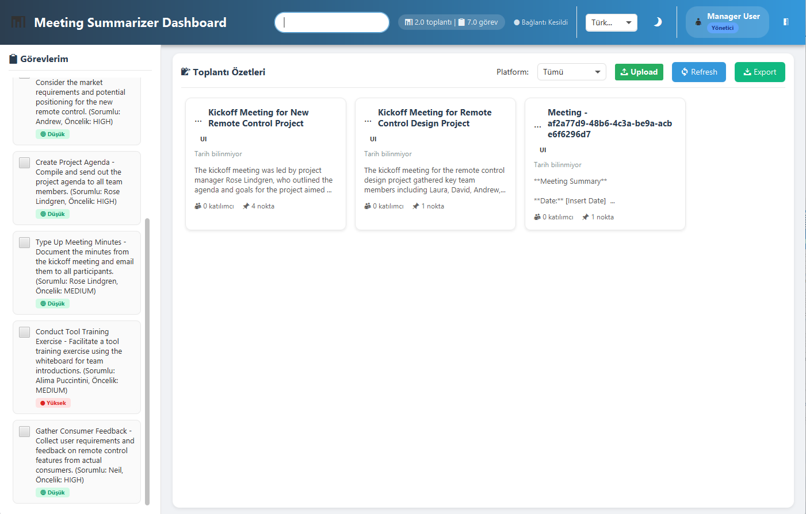

# Kafka Tabanlı Toplantı Özetleyici

Toplantı kayıtlarını otomatik olarak toplayan, işleyen ve özetleyen mikroservis mimarisi tabanlı bir sistem. Discord ve Zoom toplantılarından ses kayıtlarını alır, AI ile transkript eder, özetler ve görev çıkarır.

## Amaç

Bu proje, toplantı kayıtlarını otomatik olarak işleyerek:
- Toplantı transkriptlerini oluşturur
- Toplantı özetlerini çıkarır
- Toplantılardan görev maddelerini (action items) belirler
- Kullanıcı dostu bir arayüz ile bu bilgileri sunar

## Özellikler

- **Discord Entegrasyonu**: Discord toplantı verilerini otomatik olarak toplar
- **Çoklu Platform Desteği**: Zoom, Google Meet, Teams toplantı kayıtlarını UI üzerinden yükleme
- **Otomatik İşleme**: Ses kayıtlarını otomatik olarak transkript eder, özetler ve görev çıkarır
- **AI Destekli Analiz**: OpenAI Whisper ile ses transkripsiyonu, GPT-4 ile özet ve görev çıkarımı
- **Gerçek Zamanlı Bildirimler**: WebSocket ile anlık güncellemeler
- **Merkezi Veri Yönetimi**: Kafka Hub ile tüm veri akışının koordinasyonu
- **RESTful API**: Swagger dokümantasyonlu API Gateway
- **Modern Dashboard**: JavaFX tabanlı kullanıcı arayüzü
- **Mikroservis Mimarisi**: Ölçeklenebilir ve bakımı kolay yapı
- **Docker Desteği**: Tek komutla tüm servisleri başlatma

## Mimari

Proje mikroservis mimarisi kullanır. Veri akışı aşağıdaki gibi gerçekleşir:

```
┌─────────────────────┐         ┌─────────────────────┐         ┌─────────────────────┐
│  Collector Service  │         │ meeting_streaming   │         │   AI_Service        │
│  Discord verileri   │         │    _service         │         │   (Open Whisper     │
│  otomatik alınır,   │         │                     │         │   ve GPT-4)         │
│  ZOOM, Google Meet, │         │    KAFKA HUB        │         │                     │
│  Teams toplantı     │  Kafka  │  Veri akışını       │  Kafka  │  TRANSKRİPSİYON     │
│  kayıtları UI ile   │ Outbox  │  yönetir            │ ──────► │  GEMİNİ'YE VE       │
│  yüklenir ve        │ ──────► │                     │         │  TASKLARA           │
│  aktarılır          │         │                     │         │  AYRILIR            │
└─────────────────────┘         └──────────┬──────────┘         └──────────┬──────────┘
         ▲                                 │                               │
         │                                 │                               │
         │                                 ▼                               ▼
         │                      ┌─────────────────────┐         ┌─────────────────────┐
         │                      │    Gateway API      │         │   Kafka Topics      │
         │                      │                     │ ◄───────│                     │
         │                      │  GATEWAY_API UI     │         │ - transcriptions    │
         │                      │  İLE VERİLER        │         │ - action-items      │
         │                      │  ARASINDA KÖPRÜ     │         │ - summaries         │
         │                      │  OLUR               │         └─────────────────────┘
         │                      └──────────┬──────────┘
         │                                 │
         │                                 ▼
         │                      ┌─────────────────────┐
         └──────────────────────│         UI          │
                                │                     │
                                │  Kullanıcı Arayüzü  │
                                │  Dashboard, Tasks   │
                                └─────────────────────┘
```

### Veri Akışı

1. **Veri Toplama**: Collector Service Discord'dan otomatik veri toplar veya UI üzerinden Zoom/Google Meet/Teams kayıtları yüklenir
2. **Veri İşleme**: Meeting Streaming Service (Kafka Hub) veri akışını yönetir ve AI Service'e yönlendirir
3. **AI İşleme**: AI Service ses dosyalarını transkript eder, özetler ve görevleri çıkarır
4. **Veri Dağıtımı**: İşlenmiş veriler Kafka Topics'a (transcriptions, summaries, action-items) gönderilir
5. **Kullanıcı Erişimi**: Gateway API Kafka Topics'dan verileri alır ve UI'a iletir
6. **Görüntüleme**: UI kullanıcıya dashboard, görevler ve toplantı detaylarını sunar

## Servisler

### Collector Service (Port 8081)
- Discord toplantı verilerini otomatik olarak toplar
- Zoom, Google Meet, Teams toplantı kayıtlarını UI üzerinden yükleme desteği
- Ses kayıtlarını işleme için Kafka'ya Outbox pattern ile gönderir
- Toplantı metadata'sını veritabanına kaydeder

### Meeting Streaming Service (Port 8082)
- Kafka Hub görevi görür, tüm veri akışını yönetir
- Outbox pattern ile veri senkronizasyonu sağlar
- Collector Service'den gelen event'leri işler ve AI Service'e yönlendirir
- Veri akışının merkezi koordinasyonunu yapar

### AI Service (Port 8083)
- OpenAI Whisper modeli ile ses dosyalarını metne çevirir (transkripsiyon)
- GPT-4 modeli ile toplantı özetlerini çıkarır
- Toplantılardan görev maddelerini (action items) otomatik olarak belirler ve görevlere ayırır
- İşlenmiş verileri (transcriptions, summaries, action-items) ilgili Kafka Topics'a gönderir

### Gateway API (Port 8084)
- UI ile backend servisler arasında köprü görevi görür
- REST API endpoint'leri sunar
- WebSocket bağlantıları ile gerçek zamanlı bildirimler sağlar
- Kafka Topics'dan gelen işlenmiş verileri UI'a iletir
- JWT tabanlı kimlik doğrulama ve rate limiting
- Swagger UI: http://localhost:8084/swagger-ui.html

### Dashboard UI
- JavaFX tabanlı masaüstü uygulaması
- Gateway API üzerinden tüm verilere erişir
- Gerçek zamanlı toplantı özetleri ve görev bildirimleri alır
- Toplantı kayıtlarını yükleme (Zoom, Google Meet, Teams)
- Görev yönetimi ve toplantı detayları görüntüleme

### Kafka Topics
Sistemde kullanılan ana Kafka topic'leri:
- **transcriptions**: Ses dosyalarının transkript edilmiş halleri
- **summaries**: Toplantı özetleri
- **action-items**: Toplantılardan çıkarılan görev maddeleri

## Kurulum

### Gereksinimler

- Docker ve Docker Compose
- Java 17+
- Gradle 7+
- OpenAI API Key

### Adımlar

1. Projeyi klonlayın:
```bash
git clone <repository-url>
cd kafka-tabanli-toplanti-ozetleyici
```

2. Environment değişkenlerini ayarlayın:
```bash
copy env.example .env
```

`.env` dosyasını düzenleyip OpenAI API key'inizi ekleyin:
```
OPENAI_API_KEY=your_openai_api_key_here
```

3. Servisleri başlatın:
```bash
docker-compose up -d --build
```

4. Servislerin durumunu kontrol edin:
```bash
docker-compose ps
```

5. Dashboard UI'ı başlatın:
```bash
START-JAVAFX-UI.bat
```

## Kullanım

### Dashboard Arayüzü

Dashboard açıldığında aşağıdaki özellikleri kullanabilirsiniz:

#### Ana Ekran

Dashboard iki ana bölümden oluşur:

**Sol Panel - Görevlerim**
- Toplantılardan çıkarılan görevler listelenir
- Her görev için sorumlu kişi ve öncelik bilgisi gösterilir
- Görevleri tamamlandı olarak işaretleyebilirsiniz

**Sağ Panel - Toplantı Özetleri**
- Tüm toplantı özetleri kartlar halinde gösterilir
- Platform filtresi ile Discord, Zoom veya UI toplantılarını filtreleyebilirsiniz
- **Upload Butonu**: Zoom, Google Meet veya Teams toplantı kayıtlarını yükleyebilirsiniz
- **Refresh Butonu**: Yeni toplantı özetlerini ve görevleri yükler
- **Export Butonu**: Toplantı özetlerini dışa aktarır



#### Toplantı Detayları

Bir toplantı kartına tıkladığınızda detay sayfası açılır:

**Summary Tab**
- Toplantı başlığı ve katılımcı sayısı
- Tam toplantı özeti
- Önemli noktalar listesi

**Transcription Tab**
- Toplantının tam transkripti
- Zaman damgalı konuşma kayıtları

**Tasks Tab**
- Toplantıdan çıkarılan tüm görevler
- Görev detayları ve atanan kişiler


#### Özellikler

- **Platform Filtresi**: Sadece belirli platformlardaki toplantıları görüntüleyebilirsiniz (Discord, Zoom, UI)
- **Toplantı Yükleme**: Upload butonu ile Zoom, Google Meet veya Teams toplantı kayıtlarını yükleyebilirsiniz
- **Dil Seçimi**: Arayüz dilini değiştirebilirsiniz
- **Dark Mode**: Karanlık tema ile çalışabilirsiniz
- **Export PDF**: Toplantı özetlerini PDF olarak dışa aktarabilirsiniz
- **Gerçek Zamanlı Güncellemeler**: Yeni toplantı özetleri ve görevler otomatik olarak görüntülenir

### API Kullanımı

#### Swagger UI

API dokümantasyonuna erişmek için:
```
http://localhost:8084/swagger-ui.html
```

#### Örnek API İstekleri

**Toplantı Listesi:**
```bash
GET http://localhost:8084/api/meetings
Authorization: Bearer <token>
```

**Toplantı Özeti:**
```bash
GET http://localhost:8084/api/meetings/{meetingId}/summary
Authorization: Bearer <token>
```

**Görevler:**
```bash
GET http://localhost:8084/api/meetings/{meetingId}/action-items
Authorization: Bearer <token>
```

### WebSocket Bağlantısı

Gerçek zamanlı bildirimler için WebSocket bağlantısı:

```javascript
const ws = new WebSocket('ws://localhost:8084/ws');
ws.onmessage = (event) => {
    const data = JSON.parse(event.data);
    console.log('Notification:', data);
};
```

## Teknolojiler

- **Backend**: Spring Boot, Java 17
- **Frontend**: JavaFX
- **Message Queue**: Apache Kafka
- **Database**: MySQL 8.0
- **AI**: OpenAI (Whisper, GPT-4)
- **Containerization**: Docker, Docker Compose
- **Build Tool**: Gradle
- **API Documentation**: Swagger/OpenAPI

## Proje Yapısı

```
kafka-tabanli-toplanti-ozetleyici/
├── gateway_api/              # API Gateway servisi
├── collector_service/         # Toplantı kayıt toplama servisi
├── meeting_streaming_service/ # Veri akış servisi
├── ai_service/               # AI işleme servisi
├── meeting_dashboard_ui/      # JavaFX dashboard uygulaması
├── docker-compose.yml        # Tüm servisleri başlatma
├── env.example               # Environment değişken örneği
└── README.md                 # Bu dosya
```

## Güvenlik

- JWT tabanlı kimlik doğrulama
- Rate limiting
- Hassas bilgiler environment değişkenlerinde saklanır

## Lisans

Bu proje [LICENSE](LICENSE) dosyasında belirtilen lisans altında lisanslanmıştır.
